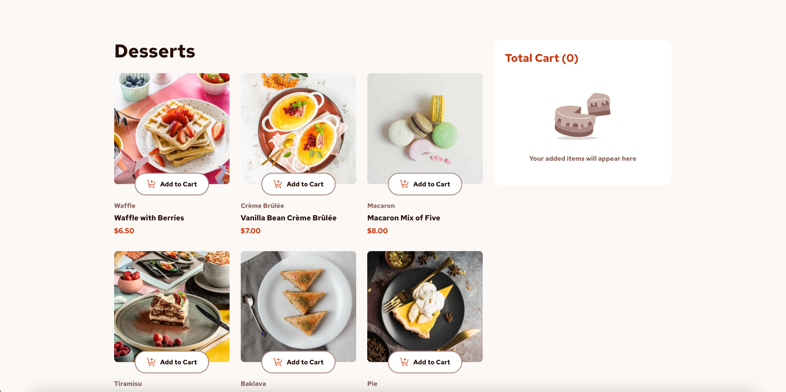
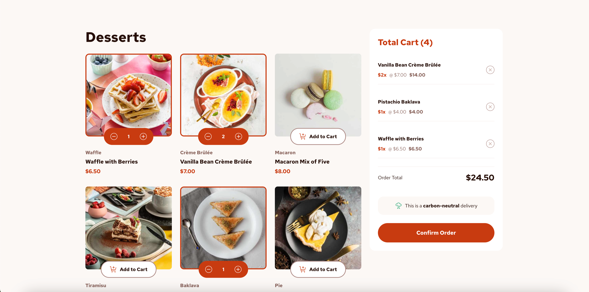

# Frontend Mentor - Product list with cart solution

This is a solution to the [Product list with cart challenge on Frontend Mentor](https://www.frontendmentor.io/challenges/product-list-with-cart-5MmqLVAp_d). Frontend Mentor challenges help you improve your coding skills by building realistic projects. 

## Table of contents

- [Overview](#overview)
  - [The challenge](#the-challenge)
  - [Screenshot](#screenshot)
  - [Links](#links)
- [Local Development](#local-development)
- [My process](#my-process)
  - [Built with](#built-with)
  - [What I learned](#what-i-learned)
  - [Continued development](#continued-development)
- [Author](#author)

## Overview

### The challenge

Users should be able to:

- Add items to the cart and remove them
- Increase/decrease the number of items in the cart
- See an order confirmation modal when they click "Confirm Order"
- Reset their selections when they click "Start New Order"
- View the optimal layout for the interface depending on their device's screen size
- See hover and focus states for all interactive elements on the page

### Screenshot




### Links

- Live Site URL: [Products with Cart Challenge](https://products-with-cart-challenge.vercel.app/)

## Local Development

To get this project running locally on your machine, follow these steps:

### Prerequisites

- Node.js (v20)
  - We recommend using [nvm](https://github.com/nvm-sh/nvm) to manage Node.js versions
  - If you have nvm installed, simply run `nvm use` in the project directory
- npm or yarn

### Installation

1. Clone the repository
```bash
git clone https://github.com/yourusername/products-list-with-cards.git
cd products-list-with-cards
```

2. Install dependencies
```bash
npm install  --save-dev
# or
yarn install
```

3. Start the development server
```bash
npm run dev
# or
yarn dev
```

4. Open your browser and visit `http://localhost:5173`

The app should now be running locally with hot-reload enabled, meaning any changes you make to the code will automatically update in the browser.

## My process

### Built with

- [React](https://reactjs.org/) - JS library (v19)
- [TypeScript](https://www.typescriptlang.org/) - For type safety
- [Vite](https://vitejs.dev/) - Build tool
- [SASS](https://sass-lang.com/) - For styles
- Mobile-first workflow
- React Context for state management
- Responsive design principles

### What I learned

One of the main challenges in this project was implementing the cart functionality, which required careful state management and proper handling of product quantities. The implementation of the context system for managing the shopping cart state across components was particularly interesting.

Key learnings include:
- State management patterns in React
- TypeScript implementation for complex state types
- Component composition for reusable cart functionality
- Responsive design implementation

### Continued development

Areas I plan to focus on in future projects:
- Advanced state management patterns
- Performance optimization in React applications
- Enhanced TypeScript usage
- Improved accessibility features

## Author

- LinkedIn - [Miguel Prada](https://www.linkedin.com/in/immprada/)
- Twitter - [@im_mprada](https://x.com/im_mprada)
